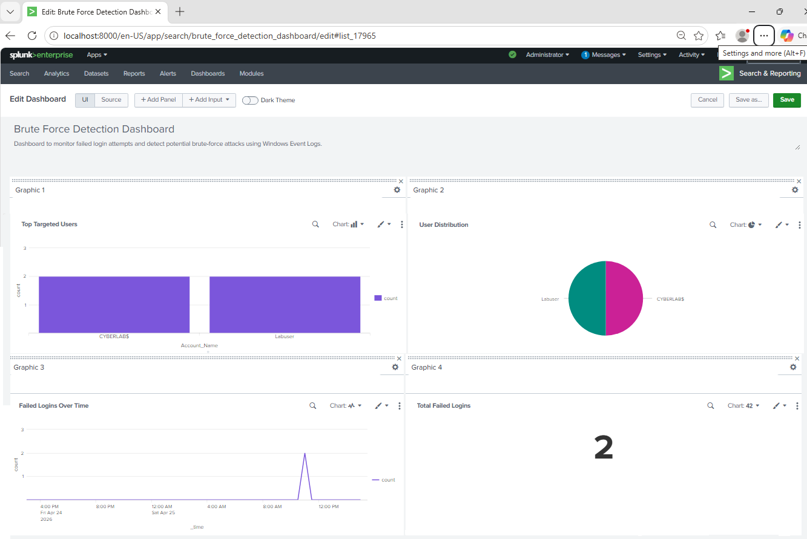
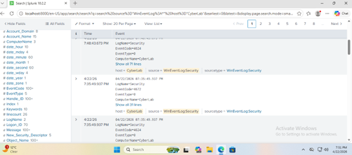
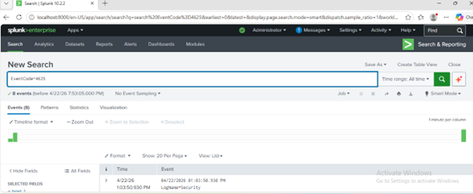
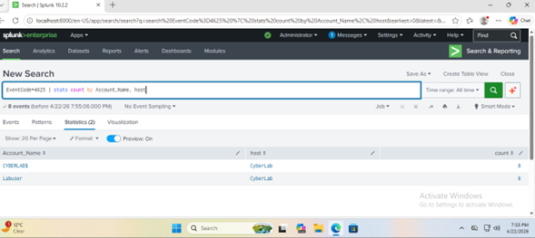
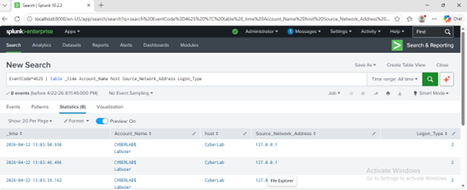

# 🛡️ SIEM Lab - Splunk Log Analysis & Brute Force Detection

## 🧠 Objective
Implement a SIEM lab using Splunk to ingest Windows Event Logs and detect failed login attempts (brute-force activity).

---

## 🛠️ Tools Used
- Splunk Enterprise (SIEM)
- Windows 11 Virtual Machine
- VMware Workstation

---

## 🧪 Scenario
A Windows machine was monitored using Splunk. Multiple failed login attempts were generated to simulate a brute-force attack against local user accounts.

---

## ⚙️ Steps

### 1. Install Splunk
- Installed Splunk Enterprise on a Windows VM  
- Accessed via: http://localhost:8000  

---

### 2. Ingest Windows Logs
- Added data using **Local Event Logs**  
- Selected:
  - Security  
  - System  

---

### 3. Simulate Attack
- Locked the system using `Win + L`  
- Entered incorrect passwords multiple times  
- Generated Event ID **4625 (failed login)**  

---

### 4. Log Analysis
## 📸 Screenshots & Analysis

### 🖥️ Splunk Dashboard

---

### 📥 Logs Loaded

---

### 🚨 Failed Login Detection
Query used: EventCode=4625  

---

### 📊 Aggregated Analysis
Query used: EventCode=4625 | stats count by Account_Name, host  

---

### 🔬 Detailed Event Analysis
Query used: EventCode=4625 | table _time Account_Name host Source_Network_Address Logon_Type  

### 🔍 Results

- Detected multiple failed login attempts  
- **Affected users:**
  - CYBERLAB$  
  - Labuser  
- **Source of activity:** 127.0.0.1 (local machine)  
- **Logon Type:** Type 2 (interactive login)

---
### 💡 Key Takeaways

- Splunk can ingest and analyze Windows Event Logs  
- Event ID 4625 is useful for detecting failed login attempts  
- Local login attempts may show 127.0.0.1 instead of an external IP  
- Failed login patterns can be analyzed by account name, host, and logon type  

---

### 💼 Skills Demonstrated

- SIEM configuration  
- Windows log analysis  
- Brute-force detection  
- Basic SOC investigation  

